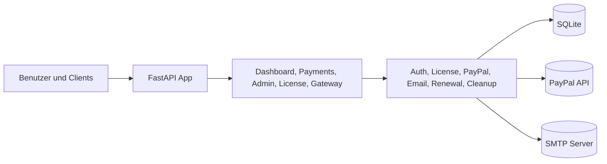

# FastAPI License Gateway + Dashboard (PayPal)

Ein stabiles Lizenzverwaltungssystem mit FastAPI-Backend, PayPal-Integration, Admin-Dashboard und sicherheitsorientierten Laufzeitpruefungen.

**Status:** ✅ Stabil | **Version:** 1.0 | **Aktualisiert:** 2026-06-20

## Installation

Vollständige Installationsanleitungen verfügbar:
- 🇩🇪 [INSTALL_DE.md](INSTALL_DE.md) (Deutsch)
- 🇬🇧 [INSTALL_EN.md](INSTALL_EN.md) (Englisch)

## Kernfunktionen

### Lizenzverwaltung
- ✅ Lizenzkauf via PayPal Checkout
- ✅ Automatische Lizenz-Ausstellung nach erfolgreicher Zahlung
- ✅ 5-Tage Testlizenz ohne PayPal (einmal pro E-Mail)
- ✅ 3 Lizenzpakete: Monatlich, Jährlich, Unbegrenzt
- ✅ Gateway-Endpunkt zur Lizenzvalidierung (Rate-limitiert: 60/Min)
- ✅ Lizenzverläangerung und Kündigung

### Admin- & Benutzer-Oberflächen
- ✅ Admin-Dashboard (superadmin/support Rollen)
- ✅ Lizenz-Benutzerbereich (Login, Verlängerung, Kündigung)
- ✅ Mehrsprachige UI (Deutsch, Englisch, Spanisch)
- ✅ Passwortänderungs-Funktion
- ✅ Admin-Benutzerverwaltung

### E-Mail-Versand
- ✅ SMTP E-Mail Versand mit Lizenzschlüsseln
- ✅ i18n-aware E-Mail-Templates
- ✅ Automatischer Retry mit exponentiellem Backoff

### Sicherheitsfeatures (gehärtet)
- 🔒 Brute-Force-Schutz (Admin & Lizenz-Logins)
  - 5 fehlgeschlagene Versuche → 15-Minuten Account-Sperre
  - Timing-Angriff-Mitigierung mit konstanter Verifizierungszeit
- 🔒 Session-Management mit 60-Minuten Timeout
- 🔒 CSRF-Schutz (Session-basiert)
- 🔒 Passwort-Komplexität erzwungen (min 10 Zeichen, gemischte Fälle, Zahlen, Sonderzeichen)
- 🔒 X-Forwarded-For Trusted-Proxy Validierung
- 🔒 PayPal Webhook Signaturverifikation
- 🔒 Audit-Logging für Admin-Aktionen
- 🔒 Docker läuft als unprivilegierter Benutzer (appuser)
- 🔒 Health-Check mit Liveness-Probe

### Technologien
- ✅ FastAPI 0.116.1 + Uvicorn
- ✅ SQLAlchemy 2.0.41 ORM
- ✅ SQLite (einfach auf PostgreSQL migrierbar)
- ✅ Bcrypt Passwort-Hashing mit SHA256 Legacy-Support
- ✅ slowapi Rate-Limiting
- ✅ Docker Containerisierung (Python 3.12-slim)
- ✅ Pytest mit umfassender Test-Abdeckung

## Projektstruktur

- app/main.py: FastAPI App + Router Registrierung
- app/config.py: Umgebungsvariablen und App-Settings
- app/db.py: SQLAlchemy Engine und Session
- app/models.py: Customer, LicensePlan, License, Payment, AdminUser
- app/schemas.py: Request/Response Modelle
- app/services/license_service.py: Lizenzlogik
- app/services/auth_service.py: Admin Login, Rollen, Passwortwechsel
- app/services/email_service.py: SMTP Versand
- app/services/paypal_service.py: PayPal API Anbindung
- app/services/renewal_service.py: Erneuerungs-Logik fuer Lizenzverlaengerungen
- app/routers/dashboard.py: Dashboard-Route
- app/routers/admin.py: Admin Login + Dashboard
- app/routers/payments.py: Checkout, Return, Webhook
- app/routers/gateway.py: Lizenzvalidierung
- app/routers/license_user.py: Lizenz-Benutzerbereich (Login, Verlaengerung, Kuendigung)
- app/templates/dashboard.html: Dashboard UI
- app/templates/admin_login.html: Admin Login UI
- app/templates/admin_dashboard.html: Admin Dashboard UI
- app/templates/admin_password.html: Passwort aendern UI
- app/templates/license_login.html: Lizenz-Benutzer Login UI
- app/templates/license_dashboard.html: Lizenz-Benutzer Dashboard UI
- tests/: Pytest Unit- und Integrationstests
- .github/workflows/tests.yml: CI Test-Workflow

## Grafiken

Vollstaendige Systemgrafiken sind in [DIAGRAMS.md](DIAGRAMS.md) verfuegbar.

### Architektur auf einen Blick

## Installation

1. Virtuelle Umgebung erstellen und aktivieren
2. Abhaengigkeiten installieren:

pip install -r requirements.txt

3. Umgebungsdatei anlegen:

- .env.example nach .env kopieren
- Folgende Felder ausfuellen:
  - PAYPAL_CLIENT_ID
  - PAYPAL_CLIENT_SECRET
  - PAYPAL_WEBHOOK_ID
  - APP_BASE_URL
  - APP_SECRET_KEY
  - SMTP_* (wenn E-Mail Versand aktiv)

## Docker (Alles in einem Container)

1. .env erstellen:

- .env.example nach .env kopieren
- APP_SECRET_KEY setzen
- PAYPAL und SMTP Werte setzen (falls genutzt)

2. Container bauen und starten:

docker compose up -d --build

3. Logs ansehen:

docker compose logs -f

4. Stoppen:

docker compose down

Hinweise zum Containerbetrieb:

- Die App laeuft auf Port 8000
- Die SQLite Datenbank liegt im Docker Volume gateway_data unter /app/data/licenses.db
- DATABASE_URL wird im Compose automatisch auf sqlite:////app/data/licenses.db gesetzt

## Start

uvicorn app.main:app --host 0.0.0.0 --port 8000 --reload

Dashboard:

http://localhost:8000/

Admin Login:

http://localhost:8000/admin/login

## Sprache umschalten

Die UI-Sprache kann per Query-Parameter gewechselt werden und wird als Cookie gespeichert:

- `?lang=de`
- `?lang=en`
- `?lang=es`

Beispiele:

- `http://localhost:8000/?lang=en`
- `http://localhost:8000/admin/login?lang=es`

## API Endpunkte

- GET /health
- POST /api/payments/checkout
- POST /api/payments/trial
- GET /api/payments/paypal/return?token=...
- GET /api/payments/paypal/cancel
- POST /api/payments/paypal/webhook
- GET /api/gateway/validate (Header: X-License-Key)
- GET /admin/login
- POST /admin/login
- GET /admin
- GET /admin/logout
- GET /admin/password
- POST /admin/password
- POST /admin/licenses/{license_id}/toggle (nur superadmin)
- GET /license/login
- POST /license/login
- GET /license/dashboard
- POST /license/renew
- POST /license/cancel
- GET /license/logout

## Rollenmodell

- superadmin: Vollzugriff inklusive Lizenz aktiv/deaktivieren
- support: Dashboard-Zugriff inklusive Admin-Benutzer anlegen/loeschen; Trial-Ausstellung und Lizenz-Toggle bleiben superadmin-only

Standard-Accounts kommen aus .env:

- DEFAULT_SUPERADMIN_USERNAME / DEFAULT_SUPERADMIN_PASSWORD
- DEFAULT_SUPPORT_USERNAME / DEFAULT_SUPPORT_PASSWORD

Um das automatische Anlegen des Support-Users zu deaktivieren, beide Werte DEFAULT_SUPPORT_USERNAME und DEFAULT_SUPPORT_PASSWORD leer lassen.

APP_SECRET_KEY wird zur Laufzeit geprueft und darf keinen Platzhalterwert verwenden.

Bitte nach dem ersten Start sofort aendern.

Passwortwechsel ist im Admin-Bereich unter /admin/password verfuegbar.

## Lizenzpakete

- Monthly: 30 Tage
- Yearly: 365 Tage
- Lifetime: kein Ablaufdatum
- Trial: 5 Tage (einmal pro E-Mail)

Rate-Limit fuer Trial (pro IP) konfigurierbar ueber:

- TRIAL_RATE_LIMIT_WINDOW_SECONDS
- TRIAL_RATE_LIMIT_MAX_REQUESTS

Automatische Loeschung inaktiver Trial-Lizenzen:

- TRIAL_INACTIVE_DELETE_AFTER_DAYS (Standard: 30)
- TRIAL_CLEANUP_INTERVAL_SECONDS (Standard: 3600)

Die Preise werden in .env gesetzt:

- PLAN_MONTHLY_PRICE_EUR
- PLAN_YEARLY_PRICE_EUR
- PLAN_LIFETIME_PRICE_EUR

## SMTP Mailversand

Wenn SMTP_ENABLED=true, wird nach erfolgreicher Lizenzausstellung automatisch eine E-Mail mit Lizenzschluessel versendet.

Notwendige Felder:

- SMTP_HOST
- SMTP_PORT
- SMTP_USER
- SMTP_PASSWORD
- SMTP_FROM_EMAIL
- SMTP_USE_TLS

## PayPal Setup (Sandbox)

1. In PayPal Developer ein Sandbox App erstellen
2. Client ID und Secret in .env eintragen
3. Im Projekt PAYPAL_MODE=sandbox setzen
4. Einen Webhook fuer dein Projekt anlegen:
   - URL: https://deine-domain/api/payments/paypal/webhook
   - Event: PAYMENT.CAPTURE.COMPLETED
5. Webhook ID in PAYPAL_WEBHOOK_ID speichern

## Wichtige Hinweise

- Fuer Produktivbetrieb Reverse Proxy + HTTPS verwenden
- Lizenzschluessel sind random UUID-basiert
- Bei bestehender alter Datenbank ggf. Datei licenses.db loeschen, damit das neue Schema sauber erzeugt wird
