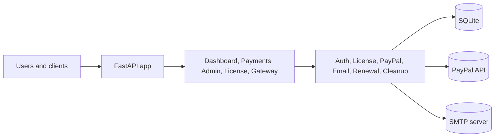

# FastAPI License Gateway + Dashboard (PayPal)

A license management system with FastAPI backend, PayPal integration, admin dashboard, and security-focused runtime checks.

**Status:** ✅ Stable | **Version:** 1.0 | **Last Updated:** 2026-06-20

## Installation

Complete setup guides available:
- 🇩🇪 [INSTALL_DE.md](INSTALL_DE.md) (German)
- 🇬🇧 [INSTALL_EN.md](INSTALL_EN.md) (English)

## Core Features

### License Management
- ✅ License purchase via PayPal checkout
- ✅ Automatic license issuance after successful payment
- ✅ 5-day trial license without PayPal (once per email)
- ✅ 3 license plans: Monthly, Yearly, Lifetime
- ✅ Gateway endpoint for license validation (rate-limited: 60/min)
- ✅ License renewal and cancellation

### Admin & User Interfaces
- ✅ Admin dashboard (superadmin/support roles)
- ✅ License user area (login, renewal, cancellation)
- ✅ Multilingual UI (German, English, Spanish)
- ✅ Password change functionality
- ✅ Admin user management

### Email Delivery
- ✅ SMTP email delivery of license keys
- ✅ i18n-aware email templates
- ✅ Automatic retry with exponential backoff

### Security Features (Hardened)
- 🔒 Brute-force protection (admin & license logins)
  - 5 failed attempts → 15-minute account lock
  - Timing-attack mitigation with constant verify time
- 🔒 Session management with 60-minute timeout
- 🔒 CSRF protection (session-based)
- 🔒 Password complexity enforcement (min 10 chars, mixed case, numbers, special chars)
- 🔒 X-Forwarded-For trusted proxy validation
- 🔒 PayPal webhook signature verification
- 🔒 Audit logging for admin actions
- 🔒 Docker runs as unprivileged user (appuser)
- 🔒 Health-check with liveness probe

### Technical Stack
- ✅ FastAPI 0.116.1 + Uvicorn
- ✅ SQLAlchemy 2.0.41 ORM
- ✅ SQLite (easily migrable to PostgreSQL)
- ✅ Bcrypt password hashing with SHA256 legacy support
- ✅ slowapi rate limiting
- ✅ Docker containerization (Python 3.12-slim)
- ✅ Pytest with comprehensive test coverage

## Project Structure

- app/main.py: FastAPI app + router registration
- app/config.py: Environment variables and app settings
- app/db.py: SQLAlchemy engine and session
- app/models.py: Customer, LicensePlan, License, Payment, AdminUser
- app/schemas.py: Request/response schemas
- app/services/license_service.py: License business logic
- app/services/auth_service.py: Admin login, roles, password change
- app/services/email_service.py: SMTP sending
- app/services/paypal_service.py: PayPal API integration
- app/services/renewal_service.py: Renewal logic for license extensions
- app/routers/dashboard.py: Dashboard route
- app/routers/admin.py: Admin login + dashboard
- app/routers/payments.py: Checkout, return, webhook
- app/routers/gateway.py: License validation
- app/routers/license_user.py: License user area (login, renewal, cancellation)
- app/templates/dashboard.html: Dashboard UI
- app/templates/admin_login.html: Admin login UI
- app/templates/admin_dashboard.html: Admin dashboard UI
- app/templates/admin_password.html: Change-password UI
- app/templates/license_login.html: License user login UI
- app/templates/license_dashboard.html: License user dashboard UI
- tests/: Pytest unit and integration tests
- .github/workflows/tests.yml: CI test workflow

## Diagrams

Complete system diagrams are available in [DIAGRAMS.md](DIAGRAMS.md).

### Architecture At A Glance

## Installation

1. Create and activate a virtual environment
2. Install dependencies:

pip install -r requirements.txt

3. Create environment file:

- Copy .env.example to .env
- Fill in the following fields:
  - PAYPAL_CLIENT_ID
  - PAYPAL_CLIENT_SECRET
  - PAYPAL_WEBHOOK_ID
  - APP_BASE_URL
  - APP_SECRET_KEY
  - SMTP_* (if email sending is enabled)

## Docker (All in One Container)

1. Create .env:

- Copy .env.example to .env
- Set APP_SECRET_KEY
- Set PayPal and SMTP values (if used)

2. Build and start container:

docker compose up -d --build

3. View logs:

docker compose logs -f

4. Stop:

docker compose down

Container runtime notes:

- The app runs on port 8000
- The SQLite database is stored in Docker volume gateway_data at /app/data/licenses.db
- DATABASE_URL is automatically set by Compose to sqlite:////app/data/licenses.db

## Start

uvicorn app.main:app --host 0.0.0.0 --port 8000 --reload

Dashboard:

http://localhost:8000/

Admin login:

http://localhost:8000/admin/login

## Language Switching

You can switch the UI language using a query parameter. The selected language is stored in a cookie:

- `?lang=de`
- `?lang=en`
- `?lang=es`

Examples:

- `http://localhost:8000/?lang=en`
- `http://localhost:8000/admin/login?lang=es`

## API Endpoints

- GET /health
- POST /api/payments/checkout
- POST /api/payments/trial
- GET /api/payments/paypal/return?token=...
- GET /api/payments/paypal/cancel
- POST /api/payments/paypal/webhook
- GET /api/gateway/validate (Header: X-License-Key)
- GET /admin/login
- POST /admin/login
- GET /admin
- GET /admin/logout
- GET /admin/password
- POST /admin/password
- POST /admin/licenses/{license_id}/toggle (superadmin only)
- GET /license/login
- POST /license/login
- GET /license/dashboard
- POST /license/renew
- POST /license/cancel
- GET /license/logout

## Role Model

- superadmin: Full access including enable/disable licenses
- support: Dashboard access including admin user create/delete; trial issuance and license toggle remain superadmin-only

Default accounts are loaded from .env:

- DEFAULT_SUPERADMIN_USERNAME / DEFAULT_SUPERADMIN_PASSWORD
- DEFAULT_SUPPORT_USERNAME / DEFAULT_SUPPORT_PASSWORD

To disable automatic support seeding, set both DEFAULT_SUPPORT_USERNAME and DEFAULT_SUPPORT_PASSWORD to empty values.

APP_SECRET_KEY is validated at runtime and must not use a placeholder value.

Change them immediately after first startup.

Password change is available under /admin/password.

## License Plans

- Monthly: 30 days
- Yearly: 365 days
- Lifetime: no expiration
- Trial: 5 days (once per email)

Trial rate limit (per IP) is configurable via:

- TRIAL_RATE_LIMIT_WINDOW_SECONDS
- TRIAL_RATE_LIMIT_MAX_REQUESTS

Automatic cleanup for inactive trial licenses:

- TRIAL_INACTIVE_DELETE_AFTER_DAYS (default: 30)
- TRIAL_CLEANUP_INTERVAL_SECONDS (default: 3600)

Prices are configured in .env:

- PLAN_MONTHLY_PRICE_EUR
- PLAN_YEARLY_PRICE_EUR
- PLAN_LIFETIME_PRICE_EUR

## SMTP Email Sending

If SMTP_ENABLED=true, an email with the license key is sent automatically after successful license issuance.

Required fields:

- SMTP_HOST
- SMTP_PORT
- SMTP_USER
- SMTP_PASSWORD
- SMTP_FROM_EMAIL
- SMTP_USE_TLS

## PayPal Setup (Sandbox)

1. Create a sandbox app in PayPal Developer
2. Put client ID and secret into .env
3. Set PAYPAL_MODE=sandbox
4. Create a webhook for your project:
   - URL: https://your-domain/api/payments/paypal/webhook
   - Event: PAYMENT.CAPTURE.COMPLETED
5. Save webhook ID in PAYPAL_WEBHOOK_ID

## Important Notes

- Use a reverse proxy + HTTPS for production
- License keys are random UUID-based
- If you have an old existing database, delete licenses.db so the new schema can be created cleanly
