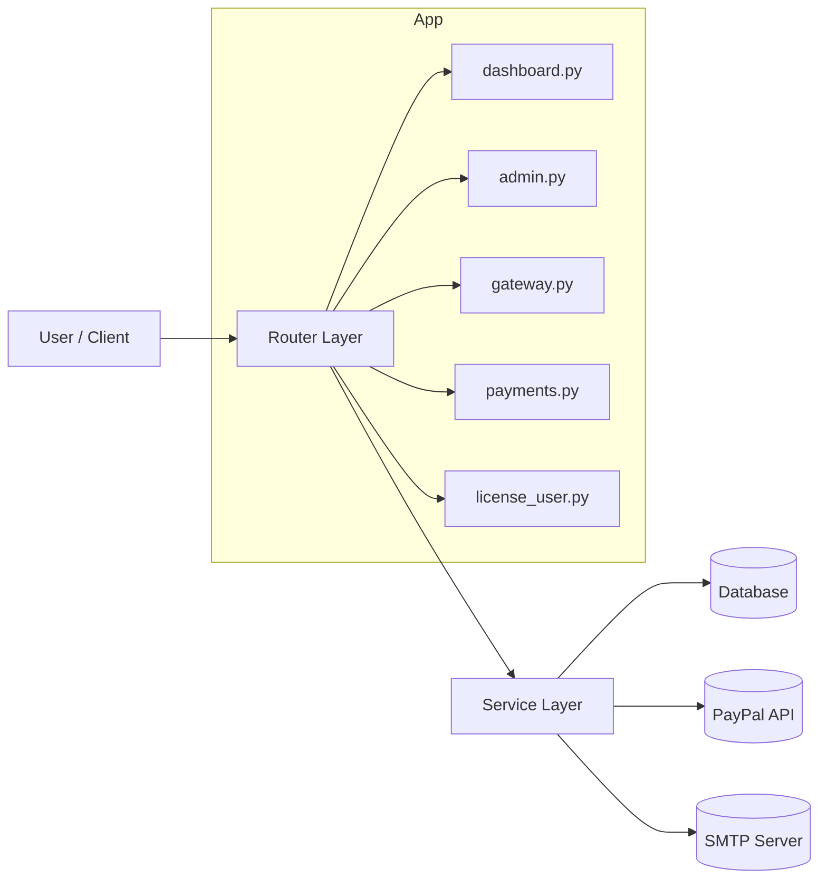

# Architektur

## Komponenten

- `app/main.py`: App-Setup, Middleware, Exception-Handler, Router-Registrierung, Lifespan
- `app/routers/*`: HTTP-Endpoints (HTML + JSON)
- `app/services/*`: Geschaeftslogik (Auth, Lizenz, PayPal, Mail, Cleanup, Renewal)
- `app/models.py`: SQLAlchemy-Modelle
- `app/db.py`: Engine, Session, Base
- `app/templates/*`: Jinja2 HTML-Oberflaechen

## Laufzeitfluss (Kauf)

1. Client sendet Checkout-Request.
2. App erstellt PayPal Order.
3. Nach Return/Webhook wird Capture verarbeitet.
4. Lizenz wird ausgestellt (oder Renewal angewendet).
5. Optional wird Lizenz-E-Mail versendet.

## Datenmodell (vereinfacht)

- `customers`
- `license_plans`
- `licenses`
- `payments`
- `license_renewal_orders`
- `admin_users`
- `admin_ui_settings`
- `admin_hero_content`
- `trial_request_logs`
- `trial_cleanup_logs`
- `license_login_attempts`
- `audit_logs`

## Architekturdiagramm

