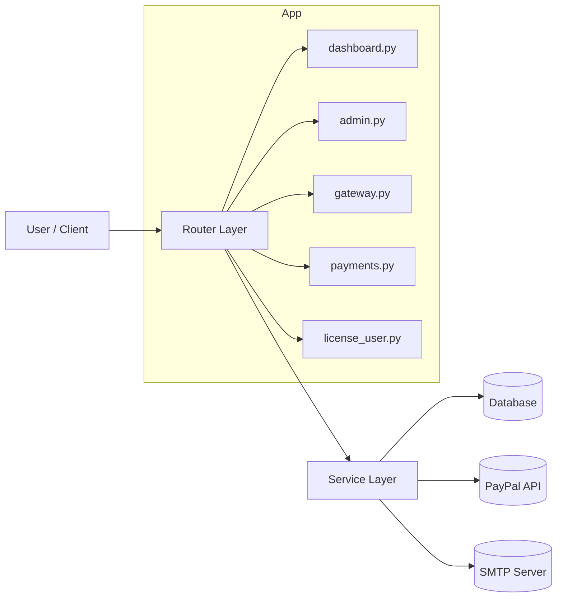

# fastapi-gateway-dashboard-server-wiki

Komplette Projektdokumentation fuer FastAPI Gateway + Dashboard Server.

## Inhalt
- [Getting Started](Getting-Started.md)
- [Installation](Installation.md)
- [Konfiguration](Konfiguration.md)
- [API](API.md)
- [Architektur](Architektur.md)
- [Deployment](Deployment.md)
- [Monitoring und Logging](Monitoring-und-Logging.md)
- [Sicherheit](Sicherheit.md)
- [Troubleshooting](Troubleshooting.md)
- [FAQ](FAQ.md)
- [Changelog](Changelog.md)

## Getting Started

### Was ist das?

FastAPI Gateway + Dashboard Server ist ein Lizenzverwaltungssystem mit folgenden Kernfunktionen:

- Lizenzverkauf per PayPal Checkout
- Automatische Lizenz-Ausstellung nach erfolgreicher Zahlung
- Testlizenz-Flow (5 Tage, einmal pro E-Mail)
- Gateway-Validierung fuer Client-Anwendungen
- Admin-Oberflaeche fuer Betrieb, Benutzerverwaltung und Monitoring
- Lizenz-Benutzerbereich fuer Login, Verlaengerung und Kuendigung

### Schnellstart in 5 Schritten

1. Projekt klonen und in den Ordner wechseln.
2. `.env` aus `.env.example` erstellen.
3. Pflichtvariablen setzen: `APP_SECRET_KEY`, Admin-Credentials, PayPal-Werte.
4. Starten mit Docker:

```bash
docker compose up -d --build
```

5. Aufrufen:
   - Dashboard: `http://localhost:8000/`
   - Admin Login: `http://localhost:8000/admin/login`
   - Health: `http://localhost:8000/health`

### Technologien

- FastAPI 0.116.1
- Uvicorn 0.35.0
- SQLAlchemy 2.0.41
- SQLite (default) oder andere SQLAlchemy-kompatible DB
- PayPal REST API
- Jinja2 Templates
- SlowAPI fuer Rate-Limiting
- Pytest fuer Tests

## Installation

### Empfohlen: Docker Compose

1. `.env` vorbereiten.
2. Container bauen und starten:

```bash
docker compose up -d --build
```

3. Status pruefen:

```bash
docker compose ps
```

4. Logs verfolgen:

```bash
docker compose logs -f
```

5. Healthcheck testen:

```bash
curl http://localhost:8000/health
```

Erwartete Antwort:

```json
{"status":"ok","service":"FastAPI License Gateway"}
```

### Optional: Lokale Installation ohne Docker

```bash
python -m venv .venv
```

PowerShell:

```powershell
.\.venv\Scripts\Activate.ps1
```

```bash
pip install -r requirements.txt
uvicorn app.main:app --host 0.0.0.0 --port 8000 --reload
```

Hinweis:

- Standard-Datenbank lokal: `sqlite:///./licenses.db`
- In Docker wird ueber Compose `sqlite:////app/data/licenses.db` gesetzt.

## Konfiguration

### Umgebungsvariablen (Uebersicht)

#### Core

- `APP_NAME`
- `APP_ENV` (`development` oder `production`)
- `APP_DEBUG`
- `APP_SECRET_KEY`
- `DATABASE_URL`
- `APP_BASE_URL`

#### PayPal

- `PAYPAL_CLIENT_ID`
- `PAYPAL_CLIENT_SECRET`
- `PAYPAL_MODE` (`sandbox` oder `live`)
- `PAYPAL_WEBHOOK_ID`

#### Preise

- `PLAN_MONTHLY_PRICE_EUR`
- `PLAN_YEARLY_PRICE_EUR`
- `PLAN_LIFETIME_PRICE_EUR`

#### Trial und Limits

- `TRIAL_INACTIVE_DELETE_AFTER_DAYS`
- `TRIAL_CLEANUP_INTERVAL_SECONDS`
- `TRIAL_RATE_LIMIT_WINDOW_SECONDS`
- `TRIAL_RATE_LIMIT_MAX_REQUESTS`

#### Login-Schutz und Session

- `BRUTE_FORCE_MAX_ATTEMPTS`
- `BRUTE_FORCE_LOCKOUT_MINUTES`
- `SESSION_TIMEOUT_MINUTES`
- `SESSION_COOKIE_SECURE` (optional, Auto-Mode per `APP_ENV`)

#### SMTP (optional)

- `SMTP_ENABLED`
- `SMTP_HOST`
- `SMTP_PORT`
- `SMTP_USER`
- `SMTP_PASSWORD`
- `SMTP_FROM_EMAIL`
- `SMTP_USE_TLS`

#### Admin-Seeding

- `DEFAULT_SUPERADMIN_USERNAME`
- `DEFAULT_SUPERADMIN_PASSWORD`
- `DEFAULT_SUPPORT_USERNAME`
- `DEFAULT_SUPPORT_PASSWORD`

### Wichtige Konfigurationsregeln

- `APP_SECRET_KEY` darf kein Platzhalter sein, sonst bricht der Start mit RuntimeError ab.
- In Produktion stoppt die App bei unsicheren Default-Admin-Passwoertern.
- Support-Seeding ist deaktivierbar, wenn `DEFAULT_SUPPORT_USERNAME` und `DEFAULT_SUPPORT_PASSWORD` leer sind.
- `APP_BASE_URL` muss mit der extern erreichbaren URL uebereinstimmen (wichtig fuer PayPal Return/Cancel/Webhook-Flows).

### Mehrsprachigkeit

Unterstuetzte Sprachen:

- `de`
- `en`
- `es`

Sprache kann per `?lang=<code>` gesetzt werden und wird als Cookie gespeichert.

## API

### Health

- `GET /health`
- Zweck: Liveness/Readiness-Basischeck
- Antwort: `{"status":"ok","service":"..."}`

### Gateway

- `GET /api/gateway/validate`
- Header: `X-License-Key`
- Rate-Limit: `60/minute`
- Antwortmodell:
  - `valid: bool`
  - `email: string | null`
  - `expires_at: datetime | null`
  - `reason: string | null`

`reason` kann sein:

- `license_not_found`
- `license_inactive`
- `license_expired`

### Payments

- `POST /api/payments/checkout`
  - Body: `email`, `full_name`, `plan_code`
  - Erlaubte `plan_code`: `monthly`, `yearly`, `lifetime`
  - Antwort: `order_id`, `approve_url`

- `POST /api/payments/trial`
  - Body: `email`, `full_name`
  - Ergebnis: Trial-Lizenz (`trial5`), wenn noch keine Trial fuer E-Mail existiert
  - Rate-Limit ueber Trial-Request-Logs/IP

- `GET /api/payments/paypal/return?token=...`
  - Captured eine Bestellung nach Rueckkehr von PayPal
  - Finalisiert Kauf oder Renewal

- `GET /api/payments/paypal/cancel`
  - Gibt Abbruchmeldung zurueck

- `POST /api/payments/paypal/webhook`
  - Verifiziert PayPal-Webhook-Signatur
  - Verarbeitet Event `PAYMENT.CAPTURE.COMPLETED`

### Dashboard und Admin (HTML)

- `GET /` (oeffentliches Dashboard)
- `GET /admin/login`
- `POST /admin/login`
- `GET /admin/logout`
- `GET /admin`
- `GET /admin/settings`
- `POST /admin/settings`
- `POST /admin/settings/reset`
- `POST /admin/licenses/{license_id}/toggle` (nur superadmin)
- `POST /admin/licenses/trial` (nur superadmin)
- `POST /admin/users/create`
- `POST /admin/users/{user_id}/delete`
- `GET /admin/password`
- `POST /admin/password`

### Lizenz-Benutzerbereich (HTML)

- `GET /license/login`
- `POST /license/login`
- `GET /license/dashboard`
- `POST /license/renew`
- `POST /license/cancel`
- `GET /license/logout`

### API-Fehlerformat

HTTP- und Validierungsfehler werden zentral als JSON ausgeliefert, z. B.:

```json
{
  "error": {
    "code": "http_error",
    "message": "..."
  }
}
```

Fuer Validation:

```json
{
  "error": {
    "code": "validation_error",
    "message": "Request validation failed",
    "details": []
  }
}
```

## Architektur

### Komponenten

- `app/main.py`: App-Setup, Middleware, Exception-Handler, Router-Registrierung, Lifespan
- `app/routers/*`: HTTP-Endpoints (HTML + JSON)
- `app/services/*`: Geschaeftslogik (Auth, Lizenz, PayPal, Mail, Cleanup, Renewal)
- `app/models.py`: SQLAlchemy-Modelle
- `app/db.py`: Engine, Session, Base
- `app/templates/*`: Jinja2 HTML-Oberflaechen

### Laufzeitfluss (Kauf)

1. Client sendet Checkout-Request.
2. App erstellt PayPal Order.
3. Nach Return/Webhook wird Capture verarbeitet.
4. Lizenz wird ausgestellt (oder Renewal angewendet).
5. Optional wird Lizenz-E-Mail versendet.

### Datenmodell (vereinfacht)

- `customers`
- `license_plans`
- `licenses`
- `payments`
- `license_renewal_orders`
- `admin_users`
- `admin_ui_settings`
- `admin_hero_content`
- `trial_request_logs`
- `trial_cleanup_logs`
- `license_login_attempts`
- `audit_logs`

### Architekturdiagramm



## Deployment

### Docker-Betrieb

- Service: `fastapi-license-gateway`
- Container-Port: `8000`
- Persistenz: Volume `gateway_data` nach `/app/data`
- Datenbank-Datei: `/app/data/licenses.db`

### Image-Details

- Basis: `python:3.12-slim`
- Startkommando: `uvicorn app.main:app --host 0.0.0.0 --port 8000`
- Container laeuft als unprivilegierter Benutzer `appuser`
- Healthcheck gegen `http://localhost:8000/health`

### Produktionsempfehlung

- Reverse Proxy vor die App (z. B. Nginx/Caddy)
- HTTPS erzwingen
- `APP_ENV=production`
- `APP_DEBUG=false`
- Starke und einzigartige Secrets/Passwoerter
- Regelmaessige Volume-Backups

## Monitoring und Logging

### Request-Logging

Middleware in der App loggt fuer jede Anfrage:

- HTTP-Methode
- Pfad
- Statuscode
- Laufzeit in Millisekunden

### Fehler-Logging

- HTTP-Fehler (warn)
- Validierungsfehler (warn)
- Unbehandelte Ausnahmen (exception)
- Spezifische Security-/Betriebsereignisse (z. B. Account-Lock, PayPal-Fehler)

### Was sollte ueberwacht werden?

- Hauefigkeit von `401`/`403`/`429`
- Login-Lockouts bei Admin und Lizenz-Login
- PayPal Capture-/Webhook-Fehler
- SMTP Versandfehler
- Growth von Trial- und Audit-Logs

### Docker-Logrotation

In Compose konfiguriert:

- `max-size: 10m`
- `max-file: 5`

## Sicherheit

### Auth und Rollen

- Admin-Rollen: `superadmin`, `support`
- Session-basiertes Admin-Login
- Session-Timeout ueber `SESSION_TIMEOUT_MINUTES`

### Brute-Force-Schutz

- Admin-Login:
  - Zaehlt Fehlversuche pro Account
  - Sperrt Account fuer `BRUTE_FORCE_LOCKOUT_MINUTES` nach `BRUTE_FORCE_MAX_ATTEMPTS`

- Lizenz-Login:
  - Zaehlt Fehlversuche pro IP + E-Mail
  - Blockiert bei Ueberschreitung (429)

### CSRF-Schutz

- Session-basierte CSRF-Tokens
- Alle sensitiven HTML-POST-Flows validieren CSRF

### Passwortsicherheit

- Komplexitaetsregel:
  - mind. 10 Zeichen
  - Gross-/Kleinbuchstaben
  - Zahl
  - Sonderzeichen
- Hashing mit bcrypt
- Legacy-SHA256 kann beim ersten erfolgreichen Login auf bcrypt migriert werden

### PayPal-Sicherheit

- Webhook-Signatur wird serverseitig verifiziert
- Untrusted Signaturen werden mit 400 abgelehnt

### Header/Proxy-Sicherheit

- `X-Forwarded-For` wird nur akzeptiert, wenn der direkte Client als trusted proxy gilt

### Session-Cookies

- `same_site=lax`
- `SESSION_COOKIE_SECURE` erzwungen oder automatisch aktiv in Produktion

## Troubleshooting

### Container startet nicht

Pruefen:

- Ist `.env` vorhanden?
- Ist `APP_SECRET_KEY` auf einen sicheren Wert gesetzt?
- Sind PayPal/SMTP-Werte korrekt, falls aktiviert?
- Logs lesen:

```bash
docker compose logs --tail 200
```

### Healthcheck nicht erreichbar

Pruefen:

- Laeuft der Container?
- Ist Port 8000 am Host frei?
- Blockiert Firewall oder Proxy?

### PayPal Checkout oder Webhook fehlschlaegt

Pruefen:

- `PAYPAL_MODE` korrekt (`sandbox`/`live`)
- `PAYPAL_CLIENT_ID`/`PAYPAL_CLIENT_SECRET` korrekt
- `PAYPAL_WEBHOOK_ID` korrekt
- `APP_BASE_URL` ist extern erreichbar und korrekt

### Keine Lizenz-E-Mail

Pruefen:

- `SMTP_ENABLED=true`
- SMTP Host/Port/User/Password korrekt
- TLS-Einstellung korrekt
- Mailserver erreichbar

### CSRF-Fehler bei Formularen (403)

Ursache:

- Token fehlt oder ist ungueltig.

Loesung:

- Formularseite neu laden und hidden `csrf_token` mitsenden.

### Tests schlagen unerwartet fehl

Wichtig:

- Testlauf erwartet `APP_ENV=testing` und `DATABASE_URL=sqlite://` vor App-Import.

## FAQ

### Ist das Dashboard oeffentlich?

Ja. `GET /` ist oeffentlich verfuegbar. Sensible Daten werden nur bei Admin-Session geladen.

### Welche Datenbank wird genutzt?

Standard ist SQLite. Ueber `DATABASE_URL` kann auf eine andere SQLAlchemy-kompatible DB gewechselt werden.

### Kann ich Support-User deaktivieren?

Ja. `DEFAULT_SUPPORT_USERNAME` und `DEFAULT_SUPPORT_PASSWORD` beide leer setzen.

### Ist APP_SECRET_KEY auf 64 Hexzeichen festgelegt?

Nein. Entscheidend ist ein starker, zufaelliger Wert. Platzhalterwerte werden abgelehnt.

### Wie funktioniert die Trial-Lizenz?

- Plan `trial5`, Laufzeit 5 Tage
- Pro E-Mail nur einmal
- Zusatzeinschraenkung durch Request-Rate-Limit pro IP

### Wie werden Lizenzen validiert?

Ueber `GET /api/gateway/validate` mit Header `X-License-Key`.

### Wie wird eine Lizenz verlaengert?

Im Lizenz-Benutzerbereich ueber `POST /license/renew` (PayPal-Flow) und anschliessende Capture-Verarbeitung.

## Changelog

### 1.0 (2026-06-20)

- Stabiler Release von FastAPI Gateway + Dashboard Server
- PayPal Checkout + Return + Webhook-Verifikation
- Trial-Lizenzen mit Rate-Limit und Cleanup-Loop
- Admin- und Lizenz-Benutzerbereich mit Session-Auth
- CSRF-Schutz fuer HTML-POST-Flows
- Brute-Force-Schutz fuer Admin- und Lizenz-Login
- Admin-UI-Einstellungen in DB (`admin_ui_settings`, `admin_hero_content`)
- Audit-Logging fuer Admin-Operationen
- Docker-Betrieb mit Healthcheck und nicht-root User
- Testabdeckung fuer Security, Gateway-Validierung und Webhook-Renewals
